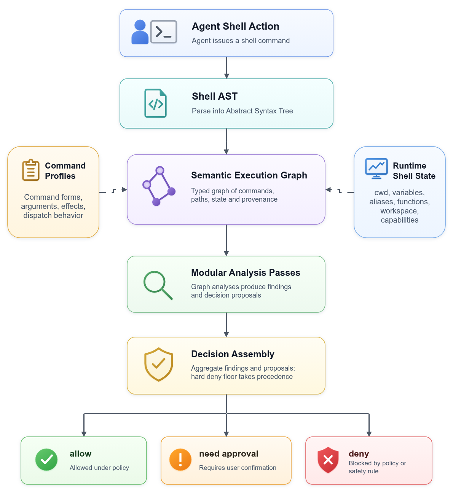
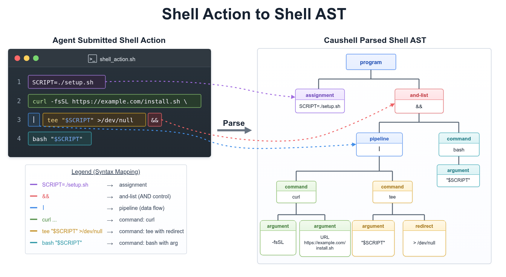
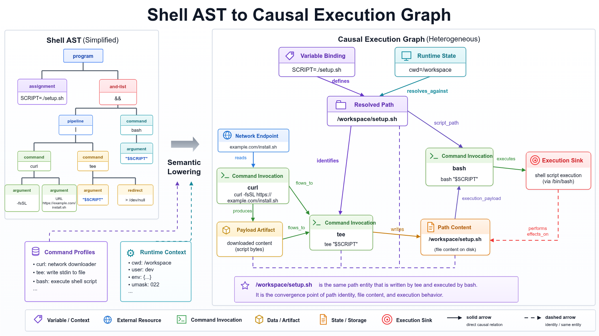
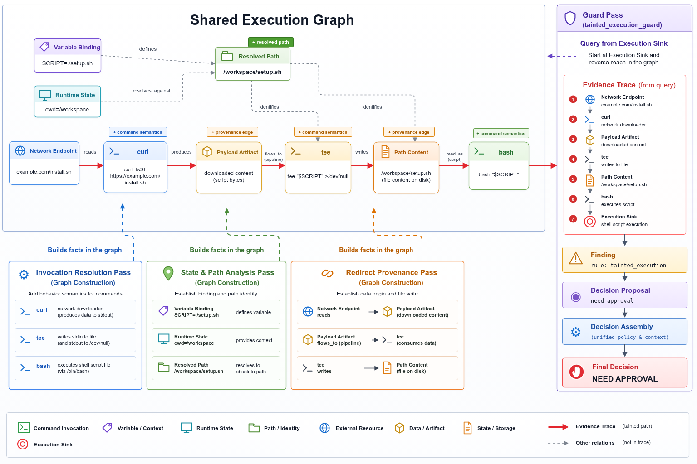

[English](README.md) | [简体中文](README.zh-CN.md)

# Caushell

> Compiler-style pre-execution safety for AI agent shell actions.

Caushell (causal + shell) runs between AI coding agents such as Codex and Claude Code and the local shell. Before a shell action reaches the local shell, Caushell performs pre-execution semantic analysis.

`Shell action → AST → session execution graph → safety analysis passes → decision`

It preserves command structure, cross-command state flow, paths, variables, working directory state, Git state, and related context, then emits reviewable structured evidence for debugging, policy extension, and audit.

<p align="center">
  
</p>

### What Caushell catches

Caushell decides based on the actual impact a shell action can have on the local environment. It covers common risk classes such as:

- Blocking deletion or overwrite of catastrophic targets such as system directories, disks, and partitions
- Requiring approval when remote content flows into a shell or interpreter
- Recognizing dangerous shell actions induced by untrusted context
- Requiring approval for destructive Git operations that affect the worktree, index, branches, or stash
- Capturing the real impact of variable expansion, globbing, redirection, pipelines, and working directory changes

The examples below show the default policy. Each check produces exactly one final decision.

| Risk | Agent shell action | Default decision |
| --- | --- | --- |
| Normal development command | `cargo test` | Allow |
| Remote content execution | `curl https://example.com/install.sh \| bash` | NeedApproval |
| Git local state discard | `git reset --hard HEAD~1` | NeedApproval |
| Git untracked file deletion | `git clean -fdx` | NeedApproval |
| Relative path delete after `cd /` | `cd / && rm -rf etc` | Deny |
| System path deletion | `rm -rf /etc/*` | Deny |
| Disk / partition overwrite | `sudo dd if=image.iso of=/dev/sda` | Deny |

## Quick start

Install the Caushell runtime:

```bash
curl -fsSL https://github.com/fatmo666/Caushell/releases/latest/download/install.sh | bash
export PATH="$HOME/.local/bin:$PATH"
```

Prebuilt releases support Linux x86_64 as a static binary, macOS x86_64, and Apple Silicon. Windows and Linux ARM64 do not have prebuilt packages yet.

Then install the integration for your agent. Codex and Claude Code call these integrations plugins.

### Codex

```bash
codex plugin marketplace add fatmo666/Caushell
codex plugin marketplace upgrade caushell
codex plugin remove caushell-codex@caushell 2>/dev/null || true
codex plugin add caushell-codex@caushell
```

Check the installation:

```bash
caushell doctor codex
```

This checks the installed binaries, hook wrapper, runtime/config compatibility, and daemon state. `runtime daemon is down` is only a warning before the first agent shell action.

To verify that Codex actually invokes the Caushell lifecycle hooks, run:

```bash
caushell doctor codex --smoke
```

The smoke test runs one harmless Codex Bash action and verifies that Caushell observed both `PreToolUse` and `PostToolUse`. The success signal is `Result: OK`.

For normal Codex use, review and trust the Caushell hook in `/hooks` if Codex asks you to do so.

### Claude Code

```bash
claude plugin marketplace add fatmo666/Caushell
claude plugin marketplace update caushell
claude plugin install caushell-claude@caushell || claude plugin update caushell-claude
```

Check the installation:

```bash
caushell doctor claude
```

This checks the installed binaries, hook wrapper, runtime/config compatibility, and daemon state. `runtime daemon is down` is only a warning before the first agent shell action.

To verify that Claude Code actually invokes the Caushell lifecycle hooks, run:

```bash
caushell doctor claude --smoke
```

The smoke test runs one harmless Claude Code Bash action and verifies that Caushell observed both `PreToolUse` and `PostToolUse`. The success signal is `Result: OK`.

## How it works

### 1. Shell action → AST

Caushell first pins the raw shell action emitted by the agent into a stable syntax structure. The AST preserves command boundaries, arguments, pipelines, redirections, command substitutions, variable references, conditional connectors, and multiline script blocks so later analysis runs on the shell's real structure.

<p align="center">
  
</p>

### 2. AST → session execution graph

After parsing, Caushell writes commands, derived invocations, path facts, data flow, working directory changes, file reads and writes, network input, and Git state changes into a session-level execution graph. Analysis passes read a configured window: they can focus on the current shell action or use state and evidence already established in the same session.

<p align="center">
  
</p>

### 3. Execution graph → safety analysis passes → decision

Safety analysis passes run on the execution graph. Each pass focuses on a verifiable risk signal, such as remote content execution, destructive file operations, path expansion, disk or partition mutation, and local state loss. The final decision assembly aggregates pass outputs and context evidence, then returns Allow, NeedApproval, or Deny.

<p align="center">
  
</p>

## Measured behavior

Caushell runs before every shell command, so latency is part of the product surface. Current measurements cover the Codex and Claude Code integrations.

| Item | Result |
| --- | --- |
| Latency | 1,000-command continuous test: Codex p95 3.10ms, Claude Code p95 3.05ms |
| Risk coverage | Remote content entering shell execution, catastrophic path deletion, disk/partition overwrite, xargs expansion, working directory changes, path/glob bypasses, destructive Git operations |

## License

Caushell is available under the [Apache License 2.0](LICENSE).
