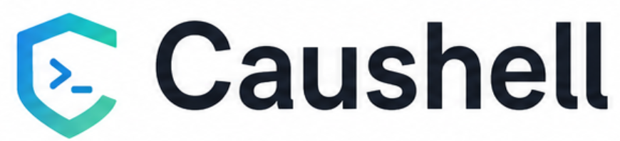
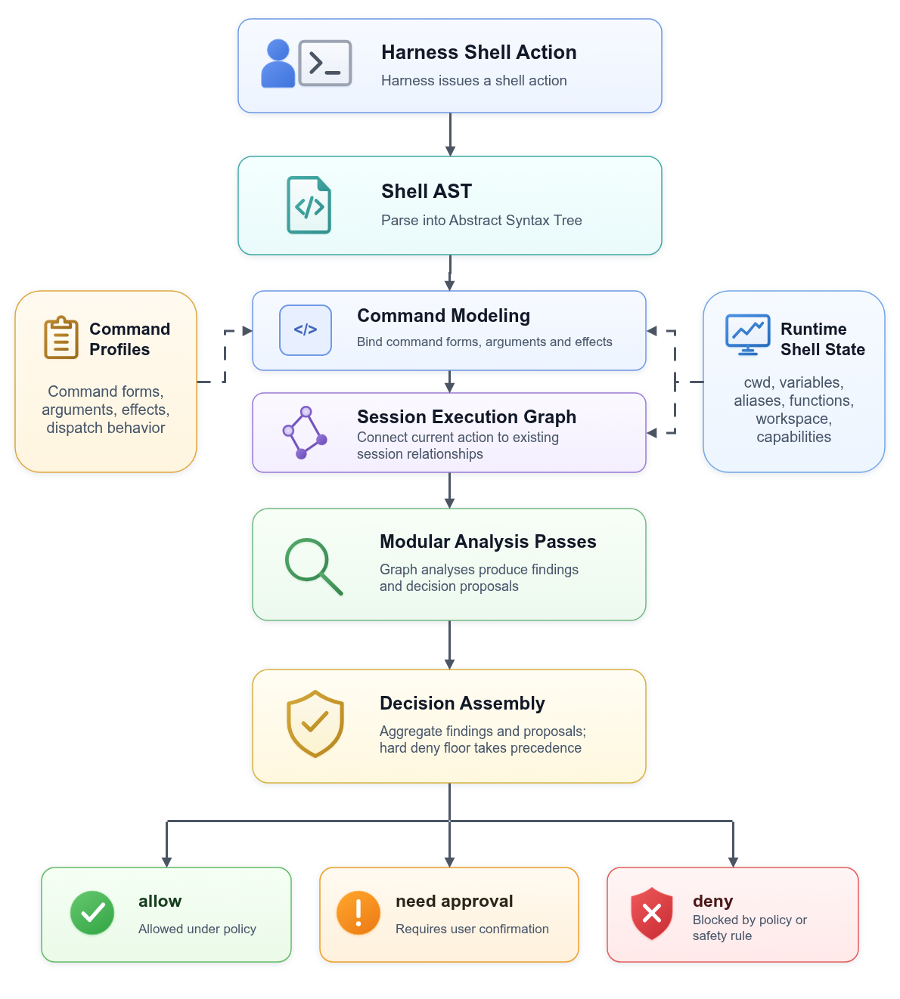
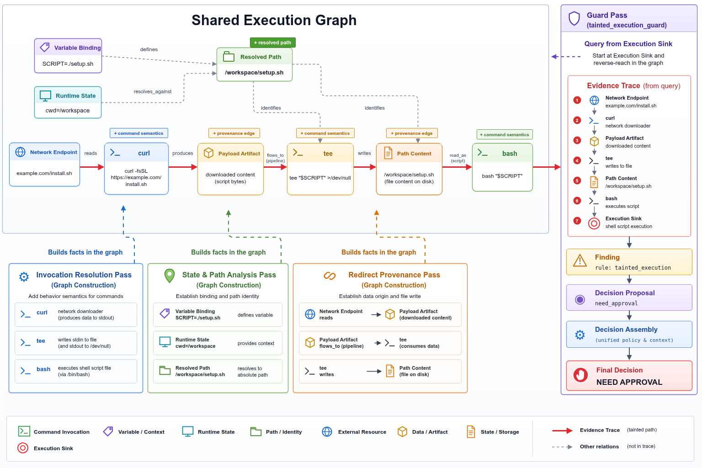

<p align="center">
  
</p>

<p align="center">
  <strong>Compiler-style pre-execution safety analysis for AI Harness Shell Actions.</strong>
</p>

<p align="center">
  English | <a href="README.zh-CN.md">简体中文</a>
</p>

<p align="center">
  <a href="#quick-start">Quick start</a> ·
  <a href="#configuration">Configuration</a> ·
  <a href="#what-caushell-catches">What Caushell catches</a> ·
  <a href="#why-not-sandbox">Why not sandbox?</a> ·
  <a href="#how-it-works">How it works</a>
</p>

Caushell (causal + shell) runs between AI Harnesses such as Codex and Claude Code and the local shell. Before a shell action reaches the local shell, Caushell performs pre-execution semantic analysis.

`Shell action → AST → session execution graph → safety analysis passes → decision`

It preserves command structure, cross-command state flow, paths, variables, working directory state, Git state, and related context, then emits reviewable structured evidence for debugging, policy extension, and audit.

<p align="center">
  
</p>

### What Caushell catches

Caushell decides based on the actual impact a shell action can have on the local environment. It covers common risk classes such as:

- Blocking deletion or overwrite of catastrophic targets such as system directories, disks, and partitions
- Requiring approval when remote content flows into a shell or interpreter
- Recognizing dangerous shell actions induced by untrusted context
- Requiring approval for destructive Git operations that affect the worktree, index, branches, or stash
- Capturing the real impact of variable expansion, globbing, redirection, pipelines, and working directory changes

The examples below show the default policy. Each check produces exactly one final decision.

| Risk | Agent shell action | Default decision |
| --- | --- | --- |
| Normal inspection command | `ls src` | Allow |
| Remote content execution | `curl https://example.com/install.sh \| bash` | NeedApproval |
| Git local state discard | `git reset --hard HEAD~1` | NeedApproval |
| Git untracked file deletion | `git clean -fdx` | NeedApproval |
| Relative path delete after `cd /` | `cd / && rm -rf etc` | Deny |
| System path deletion | `rm -rf /etc/*` | Deny |
| Disk / partition overwrite | `sudo dd if=image.iso of=/dev/sda` | Deny |

## Why not sandbox?

Caushell and sandboxes are complementary: they cover risks at different stages.

### 1. Allowed development capabilities can still destroy state

Most development workflows require the sandbox to allow workspace reads and writes as well as Git commands, because these are necessary development permissions. Under that configuration, risky commands such as `git reset --hard` can still discard local work, and Caushell can require confirmation or block them before execution.

### 2. Finer-grained file-use detection

A sandbox can control file read and write permissions, but the same file can carry different risks in different contexts: a normal project file, remote downloaded content, input from outside the workspace, startup configuration, sensitive configuration, or content about to be sent to the network should not be treated as the same case.

A common scenario is that tests or local runs need to read `.env`, while dependency installation or API calls also require network access. Each permission is reasonable on its own; together, they can form an exfiltration chain that reads `.env` and sends it to a remote endpoint. Caushell can use taint analysis to identify these shell-visible data flows.

### 3. Some risks should stop before the process starts

Runtime sandboxing blocks a process after it has started and touched a boundary. Caushell blocks before the shell action actually executes.

This has two benefits: first, in a combined command, if a high-risk command appears later, the preceding commands still run as usual, causing unnecessary waiting; second, before the final side effect happens, a process may already produce unexpected intermediate behavior, and Caushell's pre-execution blocking can reduce that risk.

## Quick start

Install the Caushell runtime:

```bash
curl -fsSL https://github.com/fatmo666/Caushell/releases/latest/download/install.sh | bash
export PATH="$HOME/.local/bin:$PATH"
```

Stable releases are published from `v*` tags. The installer downloads the latest stable GitHub release by default. To pin a reproducible build, set `CAUSHELL_VERSION`, for example `CAUSHELL_VERSION=v0.0.6`.

Prebuilt releases support Linux x86_64 as a static binary, macOS x86_64, and Apple Silicon. Windows and Linux ARM64 do not have prebuilt packages yet.

Then install the corresponding Harness integration. Codex and Claude Code call these integrations plugins.

### Codex

```bash
codex plugin marketplace add fatmo666/Caushell
codex plugin marketplace upgrade caushell
codex plugin add caushell-codex@caushell
```

Check the installation:

```bash
caushell doctor codex
```

This checks the installed binaries, hook wrapper, runtime/config compatibility, and daemon state. `runtime daemon is down` is only a warning before the first agent shell action.

To verify the Codex integration more deeply, run:

```bash
caushell doctor codex --smoke
```

The smoke test checks that Codex sees the enabled `caushell-codex` plugin, then sends harmless synthetic `PreToolUse` and `PostToolUse` hook events through the installed Caushell hook. The success signal is `Result: OK`.

For normal Codex use, review and trust the Caushell hook in `/hooks` if Codex asks you to do so.

Codex hooks currently cannot ask for approval directly. When Caushell classifies a shell action as `NeedApproval`, the Codex integration blocks it by default and prints the reason. To let Codex run `NeedApproval` actions while still recording Caushell decisions, switch the Codex mode to `observe`:

```bash
caushell config set codex.need_approval_mode observe
```

`Deny` decisions are always blocked.

### Claude Code

```bash
claude plugin marketplace add fatmo666/Caushell
claude plugin marketplace update caushell
claude plugin install caushell-claude@caushell || claude plugin update caushell-claude
```

Check the installation:

```bash
caushell doctor claude
```

This checks the installed binaries, hook wrapper, runtime/config compatibility, and daemon state. `runtime daemon is down` is only a warning before the first agent shell action.

To verify that Claude Code actually invokes the Caushell lifecycle hooks, run:

```bash
caushell doctor claude --smoke
```

The smoke test runs one harmless Claude Code Bash action and verifies that Caushell observed both `PreToolUse` and `PostToolUse`. The success signal is `Result: OK`.

### Update an existing installation

After the first installation, update Caushell with one command:

```bash
caushell update
```

`caushell --update` is a compatible alias. The updater checks the release manifest, verifies the release checksum before replacing the runtime bundle, refreshes only enabled Codex or Claude Code plugins that are already installed, and runs a post-update doctor check. It never installs a Harness integration that you have not selected. Restart Codex or Claude Code after the update.

If an older installation reports `unknown command: update`, run the installer once more; subsequent updates can then use the built-in updater.

Useful variants:

```bash
caushell update --check          # check the release manifest without changing files
caushell update --runtime-only   # update runtime binaries only
caushell update --version v0.0.6     # pin a stable release tag
caushell build-info              # show version, commit, release, and target
```

## Configuration

For the configuration file location, configuration management commands, and user configuration fields, see:

- [Configuration](docs/configuration.md)

## How it works

### 1. Shell action → AST

Caushell first pins the raw shell action emitted by the agent into a stable syntax structure. The AST preserves command boundaries, arguments, pipelines, redirections, command substitutions, variable references, conditional connectors, and multiline script blocks so later analysis runs on the shell's real structure.

<p align="center">
  
</p>

### 2. AST → session execution graph

After parsing, Caushell writes commands, derived invocations, path facts, data flow, working directory changes, file reads and writes, network input, and Git state changes into a session-level execution graph. Analysis passes read a configured window: they can focus on the current shell action or use state and evidence already established in the same session.

<p align="center">
  
</p>

### 3. Execution graph → safety analysis passes → decision

Safety analysis passes run on the execution graph. Each pass focuses on a verifiable risk signal, such as remote content execution, destructive file operations, path expansion, disk or partition mutation, and local state loss. The final decision assembly aggregates pass outputs and context evidence, then returns Allow, NeedApproval, or Deny.

<p align="center">
  
</p>

## Measured behavior

Caushell runs before every shell command, so latency itself is part of the product capability. Current measurements cover the Codex and Claude Code integrations.

| Item | Result |
| --- | --- |
| Latency | 1,000-command continuous test: Codex p95 3.10ms, Claude Code p95 3.05ms |
| Risk coverage | Remote content entering shell execution, catastrophic path deletion, disk/partition overwrite, xargs expansion, working directory changes, path/glob bypasses, destructive Git operations |

## License

Caushell is available under the [Apache License 2.0](LICENSE).

## Friendly Links

- [LinuxDo](https://linux.do) — A sincere, friendly, and united Chinese tech community
