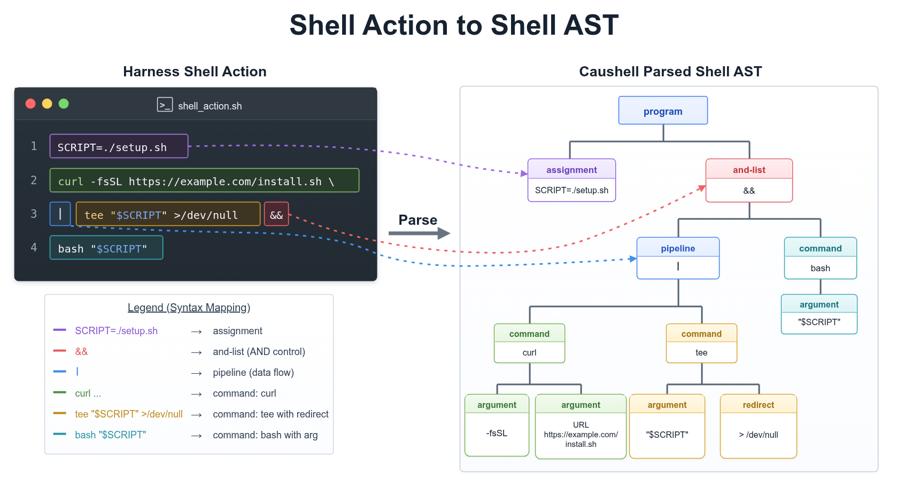
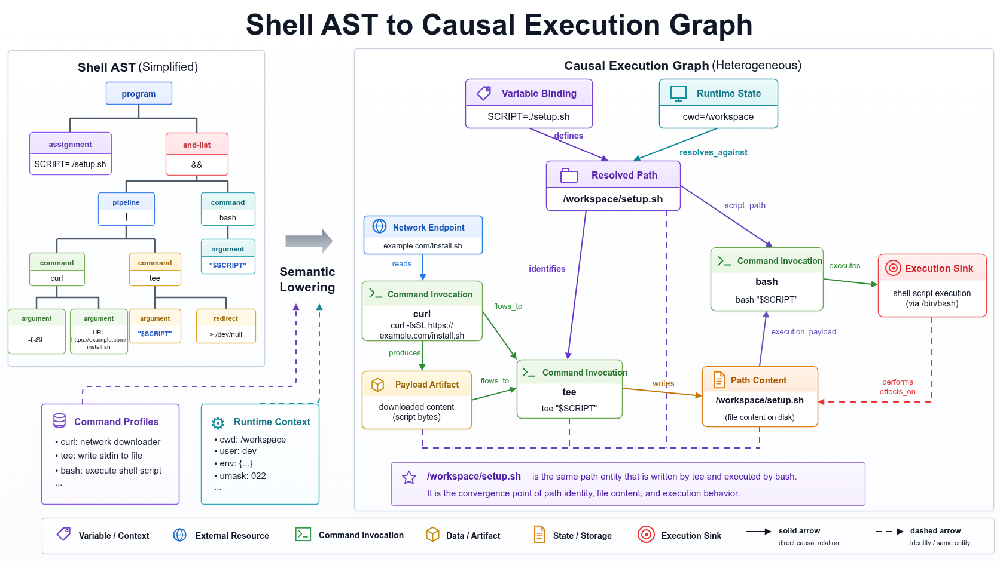

# 语义模型：AST、命令建模与会话执行图

Caushell 将 shell action 中的命令和语义关系加入可查询的会话执行图。这个过程分为语法解析、命令建模和会话图扩展，依次建立语法结构、命令行为和会话关系。

## Shell AST



图中的 action 是：

```bash
SCRIPT=./setup.sh
curl -fsSL https://example.com/install.sh \
  | tee "$SCRIPT" >/dev/null \
  && bash "$SCRIPT"
```

解析器将原始文本转换为 Shell AST，并保留后续建模需要的语法结构：

| Shell 结构 | AST 中的结构 | 后续用途 |
| --- | --- | --- |
| `SCRIPT=./setup.sh` | assignment | 建立变量绑定 |
| `curl ... \| tee ...` | pipeline | 表示标准输出到标准输入的连接 |
| `&&` | and-list | 表示后一个命令依赖前一个命令成功 |
| `curl`、`tee`、`bash` | command | 定位需要建模的命令调用 |
| `"$SCRIPT"` | variable reference | 解析变量引用 |
| `>/dev/null` | redirect | 记录重定向及其目标 |

Shell AST 是语法阶段的产出。命令行为、路径解析结果和来源关系在后续阶段建立。

## 命令建模



命令建模使用 AST 和运行时上下文，为每个命令调用补充可查询的行为语义：

| 输入 | 提供的信息 |
| --- | --- |
| Shell AST | 命令、参数、管道、重定向和控制连接 |
| Command Profiles | 命令形式、参数作用、输入输出、执行效果和子命令分派方式 |
| 运行时 shell 状态 | cwd、变量、别名、函数、位置参数及其可见性 |
| 已提交的会话事实 | 同一会话中已经建立的状态和来源关系 |

Command Profiles 描述不同命令支持的调用形式和行为。Caushell 根据与当前调用匹配的 Profile，判断各参数表示路径、网络地址还是待执行内容，并确定命令如何读取、写入或执行这些内容。

在图示 action 中：

| 命令 | 建模结果 |
| --- | --- |
| `curl` | 从网络地址读取内容并写入标准输出 |
| `tee` | 从标准输入读取内容并写入目标路径 |
| `bash` | 将目标路径作为 shell 脚本执行 |

`SCRIPT=./setup.sh` 建立变量绑定。解析变量引用后，两个命令调用可以表示为：

```bash
tee ./setup.sh
bash ./setup.sh
```

因此，`tee` 写入的目标和 `bash` 执行的脚本都指向 `./setup.sh`。这个相对路径会在会话图扩展阶段结合当前目录继续解析。

## 会话图扩展

每个会话维护一张持续更新的执行图。分析当前 action 时，Caushell 先把新产生的命令、状态和来源关系叠加到已有图上，形成本次分析使用的视图。

这个分析视图由两部分组成：

- 已经提交到会话执行图的会话事实；
- 当前 action 新产生、尚待提交的节点和边。

上图展示的是加入当前 action 后，与示例相关的部分。图中的实体分别表达：

| 图中实体 | 表达的事实 |
| --- | --- |
| Command Invocation | 当前 action 或会话历史中的命令调用 |
| Variable Binding | 变量在当前 action 或此前 action 中绑定的值 |
| Runtime State | 当前目录等运行状态 |
| Resolved Path | 结合变量和当前目录解析出的具体路径 |
| Network Endpoint | 命令访问的网络来源或目标 |
| Payload Artifact | 从网络、文件或其他输入获得的数据 |
| Path Content | 某个路径对应的文件内容 |
| Execution Sink | 脚本、解释器或其他执行目标 |

### 变量绑定与路径解析

`SCRIPT=./setup.sh` 建立变量绑定后，`tee "$SCRIPT"` 和 `bash "$SCRIPT"` 得到同一个相对路径。图中的 Runtime State 表明当前目录为 `/workspace`，因此该路径被解析为 `/workspace/setup.sh`。

`tee` 的文件写入和 `bash` 的脚本读取都指向同一个 Resolved Path，因此图会把 `tee` 写入的内容和 `bash` 读取的内容关联到同一个文件。

无法确定的变量或路径会在图中保留为未知状态，后续分析会同时考虑已知关系和这些未解析的信息。

### 来源关系

来源关系（provenance）记录数据从哪里来、经过哪些步骤、最终被如何使用。图示 action 形成下面的关系：

1. `curl` 从网络地址取得内容。
2. 管道把 `curl` 的输出交给 `tee`。
3. `tee` 将内容写入 `/workspace/setup.sh`。
4. `bash` 读取该路径，并将其中的内容送入 shell 执行。

这条关系链连接了网络来源、下载内容、文件内容和脚本执行。分析模块可以沿图反向追溯，得到可复查的证据链。

## 会话图生命周期

| 时点 | 图状态 |
| --- | --- |
| 检查开始前 | 会话执行图保存此前已经提交的会话事实 |
| 当前检查中 | 本次分析视图加入当前 action 新产生的节点和边 |
| 决策为 `Allow` | 当前 action 的图变更提交到会话执行图 |
| 决策为 `NeedApproval` 或 `Deny` | 保留本次请求记录，新增的节点和边不进入会话执行图 |

运行时 shell 状态还会标明 cwd、变量、别名和函数等信息是否可见，以及是否跨 action 保留。由 Harness 提供并经 runtime 确认的信息可以参与后续 action 的命令建模；无法确认的信息会记为未知。

## 进一步阅读

- [工作原理总览](how-it-works.zh-CN.md)
- [安全模型：风险分析、决策和执行边界](security-model.zh-CN.md)
- [配置说明](configuration.zh-CN.md)
