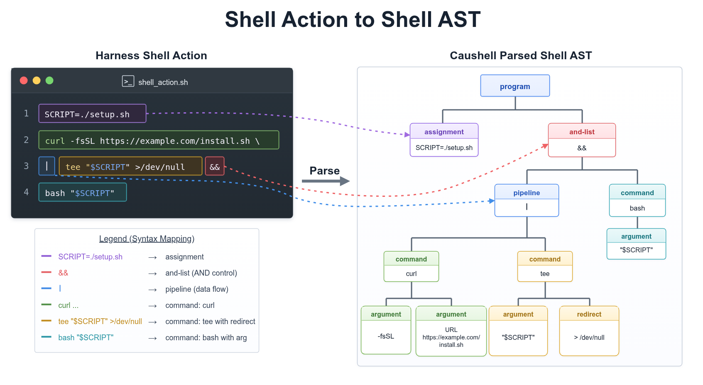
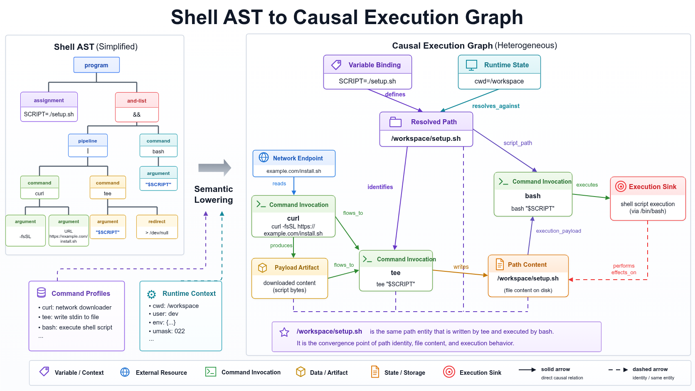

# 语义模型：AST、命令建模与会话执行图

Caushell 将 shell action 中的命令和语义关系加入可查询的会话执行图。这个过程分为语法解析、命令建模和会话图扩展，依次建立语法结构、命令行为和会话关系。

## Shell AST



图中的 action 是：

```bash
SCRIPT=./setup.sh
curl -fsSL https://example.com/install.sh \
  | tee "$SCRIPT" >/dev/null \
  && bash "$SCRIPT"
```

解析器将原始文本转换为 Shell AST，并保留后续建模需要的语法结构：

| Shell 结构 | AST 中的结构 | 后续用途 |
| --- | --- | --- |
| `SCRIPT=./setup.sh` | assignment | 建立变量绑定 |
| `curl ... \| tee ...` | pipeline | 表示标准输出到标准输入的连接 |
| `&&` | and-list | 表示后一个命令依赖前一个命令成功 |
| `curl`、`tee`、`bash` | command | 定位需要建模的命令调用 |
| `"$SCRIPT"` | variable reference | 解析变量引用 |
| `>/dev/null` | redirect | 记录重定向及其目标 |

Shell AST 是语法阶段的产出。命令行为、路径解析结果和来源关系在后续阶段建立。

完整的 Bash 双引号字符串以外层引号之间的原始文本作为 token 文本，保留换行、空白、转义、变量展开的写法、原始 source span 以及独立采集的命令替换事实。解析器不求值，也不通过拼接 AST 子节点重建文本；操作数的值由既有 argv 解码与值物化层确定。不完整的引号仍标记为部分解析。

## 命令建模



命令建模使用 AST 和运行时上下文，为每个命令调用补充可查询的行为语义：

| 输入 | 提供的信息 |
| --- | --- |
| Shell AST | 命令、参数、管道、重定向和控制连接 |
| Command Profiles | 命令形式、参数作用、输入输出、执行效果和子命令分派方式 |
| 运行时 shell 状态 | cwd、变量、别名、函数、位置参数及其可见性 |
| 已提交的会话事实 | 同一会话中已经建立的状态和来源关系 |

Command Profiles 描述不同命令支持的调用形式和行为。Caushell 根据与当前调用匹配的 Profile，判断各参数表示路径、网络地址还是待执行内容，并确定命令如何读取、写入或执行这些内容。

在图示 action 中：

| 命令 | 建模结果 |
| --- | --- |
| `curl` | 从网络地址读取内容并写入标准输出 |
| `tee` | 从标准输入读取内容并写入目标路径 |
| `bash` | 将目标路径作为 shell 脚本执行 |

`SCRIPT=./setup.sh` 建立变量绑定。解析变量引用后，两个命令调用可以表示为：

```bash
tee ./setup.sh
bash ./setup.sh
```

因此，`tee` 写入的目标和 `bash` 执行的脚本都指向 `./setup.sh`。这个相对路径会在会话图扩展阶段结合当前目录继续解析。

### 参数值投影

当操作数除了路径还包含其他信息时，路径参数可以声明 `value_projection`。绑定结果仍保留完整参数、源码位置、绑定来源和物化来源信息，路径分析使用单独的语义视图；命令分派和实际 argv 不会因此被改写。

```yaml
- name: test_paths
  semantic: {kind: path, role: read, purpose: generic_operand}
  binding: {kind: remaining_positionals}
  cardinality: optional_many
  value_projection:
    kind: prefix_before
    delimiter: "::"
    if_absent: original

- name: cache_path
  semantic: {kind: path, role: write, purpose: generic_operand}
  binding: {kind: following_flag, flag: "--override", operand_mode: next_arg}
  cardinality: optional_many
  value_projection:
    kind: key_value
    separator: "="
    key: cache_dir
```

`prefix_before` 提取第一个分隔符前面的文本：`tests/test_api.py::test_login` 在路径分析中表示 `tests/test_api.py`。没有分隔符时，`if_absent: original`（默认值）保留整个操作数，`if_absent: unknown` 则保留未知。`key_value` 完整匹配第一个分隔符前面的键：`cache_dir=/etc/pytest-cache` 提供路径 `/etc/pytest-cache`，`console_output_style=classic` 不提供缓存路径；值中后续的 `=` 不会被截掉。

未知与不适用严格区分。投影后为空、格式不完整、值无法解析、或来自隐式运行时操作数时，都保留未知；已确认不匹配的键不生成路径，也不触发“目标未解析”的修改兜底。未引用的动态展开可能产生更多 argv，所以固定前缀不足以证明路径完整或参数不适用。对于完整双引号包裹的参数，已经完成的静态分隔符可以确定路径前缀或不匹配的键，即使后缀仍未知。已物化的精确值和解码后的字面数据不会二次展开；整个操作数的运行时路径域不会直接继承给其子串。

路径事实、文件内容来源关系、修改目标、派生路径及灾难性目标判断使用同一语义视图。投影根目录未知时，派生效果仍保留未知，不会消失。审批或拒绝由已有护栏决定，不新增风险 pass 或命令名特例。多个绑定操作数分别投影，不擅自采用某个命令的重复选项优先级规则。

此声明目前只用于 `cwd_anchor` 以外的文件系统 `path` 语义，不用于命令引用或 payload。不声明时沿用已有视图，不分配投影值。投影本身不会激活 Profile 或发现配置；内置 pytest Profile 将它与下面的配置路径声明结合使用。

### 结构化参数与编码 argv

`structured_projection` 为 plain-value 参数声明工具自己的小语法：可选的列表分隔符、按顺序匹配的 literal／prefix 分支，以及 fallback。prefix 匹配会消费前缀；没有 target 的分支表示已确认无相关效果。各 target 声明不同的虚拟 slot 和语义，原始 argv 不变，源码位置及物化来源仍保留。`sources` 按顺序选择首个存在的原始 slot；显式未知不会退回后面的默认值。分隔符、slot 引用与命名冲突在加载时验证。

```yaml
structured_projection:
  separator: ','
  branches:
    - matcher: {kind: literal, value: '-'}
    - matcher: {kind: prefix, value: '@'}
      target:
        name: child_commands
        semantic: {kind: command_ref, dispatch: wrapper_command}
  fallback:
    name: output_bases
    semantic: {kind: plain_value}
```

分派 target 可声明 `command_whitespace_argv: child_commands`，将每个语义值按空白拆成 executable／argv，而不是再解析为 Bash。程序名与参数都标为 argv 数据；字面量 `$`、引号、管道和分号不会被二次解释。解析失败保留未解析子调用，未知写入目标也不会变成“没有修改”。原有标量 `value_projection` 不变；只有声明这种语法的参数才进行结构化解码。

`stdin_from_parent: true` 表示父工具将生成的数据交给子调用 stdin。现有分派、执行上下文和流来源提取记录这条关系，内容保持不透明，并沿包装分派保留；`@bash` 因此需要审批。包装层内未解析的分派也保留到既有审批兜底，无需新增风险 pass 或 Harness 字段。

首个使用者为 `nsys stats/analyze --output`，区分控制台、文件 basename、默认 basename 和 `@command`。生成的报告用 `sibling_files` 表示为确定目录下的 `BoundedPathSet`，不虚构一个名为 basename 的实际文件；目录在拼接报告名之前归一化。读取 `.nsys-rep` 时的潜在 SQLite 创建及显式 `--sqlite` 目标独立保留；帮助不触发这些效果。

本轮不覆盖持久采集会话、profile/start/launch/stop、回调和报告模板。已列出的内置报告／规则及格式可静态接受；其他报告或格式、附加参数及自定义目录作为不透明代码引用送审。列表对齐和执行次数不作精确重演，所有输出项均保留为候选，可能增加审批。没有读取报告内容或动态探测进程。

依据：[NVIDIA CLI 文档](https://docs.nvidia.com/nsight-systems/UserGuide/index.html#cli-stats-command-switch-options)。

### 结构化补丁数据与修改目标

Form 可选择声明 `payload_projections`，解析完整的工具数据协议，而不是 Bash 或其他可执行语言；未声明的形式不扫描。首个格式为 `codex_apply_patch`，由 Profile 选择，不在共享绑定器中按命令名特判：

```yaml
payload_projections:
  - format: codex_apply_patch
    source: {kind: slot, name: patch}
    reads: patch_reads
    writes: patch_writes
    deletes: patch_deletes
    max_bytes: 1048576
    max_operations: 4096
effects:
  - {kind: read_path, target: {kind: slot, name: patch_reads}}
  - {kind: write_path, target: {kind: slot, name: patch_writes}}
  - {kind: delete_path, target: {kind: slot, name: patch_deletes}}
```

来源必须为未投影的 plain-value 参数；也可声明 `source: {kind: stdin}`，此时要求 plain `stdin_data` 输入。三个目标 slot 不得重名或与已有 slot 冲突，Form 必须声明相应效果。默认限制为 1 MiB 和 4096 个操作，均要求大于零。`no_arguments` 区分无参数与 flag／`--`，不同于只判断位置参数的 `no_positional_args`。

内置 `apply_patch`／`applypatch` Profile 接受一个完整补丁参数，或无参数时的有效 stdin。新增产生写入；更新产生读取和写入；删除产生删除；更新并移动产生源路径读取／删除和目标路径写入。批量操作保留所有目标。空补丁和已证明不存在的效果类别使用明确的空语义视图，不产生未知修改。审批或拒绝复用现有工作区修改及灾难性效果护栏，没有新增风险 Pass 或 Harness 请求字段。

解码器验证完整边界、操作头和更新块，不实际应用补丁，不把新增行或上下文行解释成命令。路径保留字面字节、空格及 Unicode，不二次展开文件名；外层 Shell 参数仍先进行已有物化。截断、非法、动态、超限或带环境选择标记的输入保留未知写入／删除，不把成功解析的前缀当成安全证明。纯解码与输入大小线性相关；原始来源按效果类别保存一次，不按每个文件复制整份补丁。

统一执行解析入口仅在既有静态证据证明完整 stdin 时提供内容：显式重定向覆盖管道，多个 stdin 重定向以最后一个为准。环境 stdin、未知文件内容、部分片段及父工具生成的不透明输出均保留未知，包装链不会把父工具原 stdin 当成其输出。没有探测宿主机文件或进程。补丁实际成功、最终文件精确内容和独立非 Shell 编辑工具不属于此范围；上游 Shell 参数物化的未支持形式继续保守送审。

协议依据：[固定 Codex apply-patch 解析器源码](https://github.com/openai/codex/tree/f6fd7f17ed2ef4bf28e5b320789d764350ce4529/codex-rs/apply-patch/src)。这是固定实现的契约，不宣称涵盖所有未来版本。

### 不透明参数文件与 Ruff 效果

Profile 可以声明完整 argv 的参数文件识别：

```yaml
argument_files:
  - prefix: '@'
    possible_effects: [read_path, write_path, delete_path]
```

在工具选项绑定之前，检查已物化的完整 argv，包括选项值和 `--` 后的参数。未知 argv 保留可能展开的解释。声明的文件效果具有未知目标，写入／删除交给既有修改护栏审批；不读取参数文件或探测文件系统。工具支持已有字面 `@path` 时，因此保守保留两种可能。未声明的 Profile 不扫描参数文件。载入时拒绝空前缀、空效果列表和非文件效果。

形式匹配失败时，部分绑定已保留的修改效果仍进入修改护栏。路径参数的基础角色不排他：读取参数上的写入效果也生成 Graph 的写入 PathFact。这是命令无关的事实保留修正，不新增策略或 pass。

Ruff Profile 覆盖直接 `check`、`format`、`clean` 和信息查询。普通 `check` 保留潜在源文件修改，因为未读取的配置可能启用 `fix` 或 `fix-only`；单独 `--no-fix` 不足以证明只读。`--diff`、检查信息模式，或不存在冲突修复／抑制开关的 `--no-fix --no-fix-only` 才取消源文件修改。`format --check/--diff` 同理。默认输入为 cwd。`--stdin-filename` 只是 stdin 身份，不是磁盘输出目标；check 的 watch／抑制模式仍保留文件处理效果。

Ruff 拒绝 `--diff` 与 `--add-noqa/--add-ignore` 同用；Profile 对冲突的修复／抑制组合保守保留源文件修改候选，不将其当作有效只读形式。检查信息模式在抑制处理之前返回。源文件只读不取消 check 的独立报告输出。显式缓存／报告目标采用配置路径；默认未知缓存沿用已选定的附带缓存豁免。清理缓存是未知删除，不享有隐含写入豁免。环境未知不等于变量不存在：shell-state 观察范围不足时，可能存在 `RUFF_OUTPUT_FILE` 并要求审批；显式 CLI 输出优先。

新增按声明启用的 `toml_string` 值投影，例如 `{kind: toml_string, key: cache-dir}`，提取顶层 TOML 字符串键。使用 TOML 解析器处理引号和转义，非法或动态值保留未知。Ruff `--config` 同时接受文件和 TOML，已存在文件优先；不探测存在性时，赋值形式的操作数提供潜在内联缓存目标，文件内容及其隐藏设置仍不读取。不按后缀猜类型。本轮不宣称覆盖 `analyze`、`server`、Python 模块入口和任意配置／代码行为。

依据：[Ruff 配置](https://docs.astral.sh/ruff/configuration/)、[设置](https://docs.astral.sh/ruff/settings/)、[固定 CLI 源码](https://github.com/astral-sh/ruff/tree/127e77ef8bee49f21c0e7c2ff1e38ccf27fb522a/crates/ruff/src)。

### SQLite CLI 与不透明执行输入

`sqlite3` Profile 表达数据库操作数、主文件及 `-journal`／`-wal`／`-shm` 的潜在写入、内联 SQL／点命令、stdin、`-cmd`、启动配置和 VFS 代码加载。`:memory:` 和省略数据库时的默认内存模式不生成文件路径；URI 数据库保持不透明，不伪造为 cwd 下的 `file:` 路径。不探测文件／脚本分派或数据库内容，首个操作数只是潜在数据库，并非已经确认的数据库文件；由脚本分派选中的后续目标保留未知。

`sqlite_cli` 是保留到 Graph、证据与 Query 的 payload 语言元数据，表示 SQL 加 SQLite 点命令，不是 Bash；它不启用 SQL 解释器，也不会从 `.shell` 文本伪造 Shell 子调用。内联输入忽略 stdin，stdin 形式保留可执行输入来源。`--noinit` 同时取消默认和显式 init 加载；否则保留明确的 init 路径，或将 XDG／home 默认启动位置保持未知。复合／未识别选项从完整未消费 argv 中保留为不透明客户端语法；像 flag 的值、完整选项名及 `--` 归属沿用共享绑定器。

所有 SQL／客户端执行均保留未知写入候选，由已有修改护栏要求审批，包括表面上的 `SELECT`、`--readonly`、`:memory:` 和 `--safe --noinit` 调用。这是明确的不透明执行边界，不是声称每条查询都会写入。readonly 保护普通主数据库，不能保证点命令／函数没有副作用；WAL 附属文件及自动检测的 ZIP 后端也不支持把整个调用断言为只读。未知客户端效果要求审批时，数据库及附属文件效果仍单独可见。

原生 safe 模式不获得工作区隔离豁免：启动脚本在其启用之前执行，`-cmd` 顺序及 nonce 可以绕过限制，即使 `--safe --noinit` 也允许指定工作区外的 `temp_store_directory`。没有通过 SQL 正文过滤假装完成分析。不带数据库、提前执行／取值选项或未识别选项的纯 `--noinit --help/--version` 是信息查询。本轮没有新增风险 Pass、命令名底层特例、动态探测、依赖或 Harness 请求字段。

依据：[SQLite CLI](https://sqlite.org/cli.html)、[固定 SQLite 3.53.4 CLI 源码](https://github.com/sqlite/sqlite/blob/b09c88c14082339b66c7b7158d609a771e64ca69/src/shell.c.in)。

### Socket 查询与暂缓审查的连接关闭

Linux iproute2 的 `ss` Profile 将普通查询与 `-K/--kill` 的 `close_sockets_unchecked` 形式分开。当前关闭连接本身不触发审批，这是明确的产品风险范围选择，不是将其判成只读。没有新增 socket 控制效果、进程 kill 替代事实、风险 pass 或动态连接探测；Profile 保留独立 form 与风险范围说明，Graph 保留 form ID。通用短选项匹配器保留带参数选项之前的已声明无参数前缀，包括 `-KtF-` 紧凑写法和 `-4` 等数字选项；遇到参数边界就停止，不将参数文本扫描成后续选项。完整选项词模式和 `--` 的既有语义不变。

`-D/--diag` 的文件写入独立保留，包括关闭连接形式；工作区外或未知输出仍要求审批。`-F/--filter` 仅表示文件读取或普通 stdin 过滤数据，不当作 Bash 或嵌套命令。上游按操作数首字节判断：以 `-` 开头的诊断目标使用 stdout，过滤输入使用 stdin；`./-name` 仍是实际路径。沿用结构化投影保留原参数及未知路径候选；旧短选项匹配器未绑定的紧凑操作数使用下述可选前缀范围声明。未知过滤输入保留未知读取目标，不宣称已经确定实际使用文件还是 stdin。

Socket 匹配表达式、family／table、namespace 名称和 BPF map ID 都是普通值：匹配 UNIX socket 路径不等于文件修改，匹配远端地址不等于向它上传数据。`-p` 查看进程，`-E` 观察关闭事件，都不制造进程控制事实。帮助／版本查询抑制延后执行的诊断输出，但 Shell 组合中的写入和删除仍独立检查。重复诊断目标保守保留，不精确重放最后参数优先级；不覆盖 resolver 内部行为、过滤语法验证、选项缩写、构建特性和全部非法组合。

依据：[ss 手册](https://man7.org/linux/man-pages/man8/ss.8.html)、[固定上游源码](https://github.com/iproute2/iproute2/blob/e11870d5b9414b2e0770463bd6fc2399744dc734/misc/ss.c)。

### 配置路径与附带缓存写入

当路径来自多个选项或配置覆盖项时，效果可以声明 `configured_path`。来源按声明顺序检查，采用第一个适用来源；同一来源中采用最后一个适用的 argv 值。显式未知值不会退回低优先级来源或隐含默认值。完整操作数、绑定归属及物化元数据仍保留。

```yaml
kind: write_path
target:
  kind: configured_path
  sources:
    - slot: overrides
      projection: {kind: key_value, separator: "=", key: cache_dir}
  relative_to:
    slot: rootdir
    expand_environment: true
    fallback_parent_slot: config_file
  expand_environment: true
  expand_user: true
  missing: incidental_cache
  purpose: incidental_cache
```

绝对目标不依赖锚点；相对目标使用声明的锚点，主锚点缺席时可使用备用配置文件操作数的父目录。主锚点未知不等于缺席，不能退回备用值。没有声明锚点时相对路径使用 cwd；要求锚点但无法确定时保留未知。工具自身的环境变量展开需要显式声明，未解析的环境引用保留未知，不读取护栏进程的环境；家目录展开使用请求提供的 home，不查询其他用户。

`missing: skip` 表示没有适用来源就不生成目标；`missing: unknown` 保留未知目标，交给既有护栏判断。`missing: incidental_cache` 在 Graph 中保留未知缓存写入事实，但现有工作区外修改护栏不为这项隐含写入请求审批。Profile 载入时限定该声明只能用于 `write_path` 且用途为 `incidental_cache`。一旦选中了显式来源，即使值为空或未知，也不能获得豁免；仅标记缓存用途不足以跳过检查。`default_value` 可提供 `pytestdebug.log` 等固定字面默认值，但不能与未知兜底同时声明。来源及锚点引用的 slot 必须已声明。

直接调用 pytest/py.test 的 Profile 覆盖测试选择器、配置及插件加载边界、缓存覆盖和清理、JUnit 报告、日志文件以及显式临时目录清理。内置 CLI 行为依据 [pytest 9.0.2 缓存源码](https://github.com/pytest-dev/pytest/blob/9.0.2/src/_pytest/cacheprovider.py)、[根目录选择](https://github.com/pytest-dev/pytest/blob/9.0.2/src/_pytest/config/findpaths.py)、[JUnit 输出](https://github.com/pytest-dev/pytest/blob/9.0.2/src/_pytest/junitxml.py)、[日志](https://github.com/pytest-dev/pytest/blob/9.0.2/src/_pytest/logging.py)及[临时目录处理](https://github.com/pytest-dev/pytest/blob/9.0.2/src/_pytest/tmpdir.py)。缓存路径相对 rootdir，而初始 CLI/ini 日志输出和 JUnit 报告相对 cwd；重复覆盖采用最后一个匹配键，CLI 日志路径优先于 ini 覆盖。

cwd 与工作区均为 `/workspace` 时，默认 `pytest tests/` 放行隐含未知缓存写入。显式 `-o cache_dir=/etc/cache`、显式未知输出、目标未知的 `--cache-clear`，以及工作区外的报告、日志和 basetemp 目标仍需要审批。显式目标落在工作区且必要锚点已确定时允许。shell 重定向、删除和其他命令独立检查，不新增 pass 或 pytest 命令名分支。

本轮不解释配置内容、环境注入的附加选项、测试／插件 Python 代码，也不探测运行时文件系统。未读取的配置可能将隐含缓存重定向到工作区外；放行这项未知附带写入是已选定的策略取舍，不是认定其目标在工作区内。配置或 Python 代码隐藏的非缓存写入不属于这些 CLI 声明声称覆盖的范围。Python `-m pytest` 分派仍是独立待办。

### Conda 环境目标

直接 Conda Profile 建模环境创建、包安装／更新／删除、对应的 `env` 操作、查询及显式导出。事务通过 `configured_path` 声明可能的写入与删除，采用最后一个显式 `-p/--prefix` 值。环境名、当前激活环境以及未读取定义／配置文件里的目标，不足以确定文件系统路径：保留未知目标，由既有工作区外修改护栏要求审批。已确定的 prefix 正常判断工作区范围。不增加动态探测、Harness 字段或 Conda 专用风险 pass。前缀选项依据 [Conda 26.7.0 CLI helpers](https://github.com/conda/conda/blob/26.7.0/conda/cli/helpers.py) 核查。

标准事务预演不声明环境修改或安装包逻辑执行，但 shell 重定向和相邻命令独立检查。install/update 的 download-only 不将包链接进环境；create 则仍声明可能删除 prefix，因为它可能在事务处理前移除已有环境，见[创建流程](https://github.com/conda/conda/blob/26.7.0/conda/cli/main_create.py)和[事务处理](https://github.com/conda/conda/blob/26.7.0/conda/cli/install.py)。定义文件是输入，不是环境修改目标。查询和 stdout 导出不虚构环境写入；`export -f` 提供独立输出路径，工具层不额外展开家目录或环境变量，见[导出实现](https://github.com/conda/conda/blob/26.7.0/conda/cli/main_export.py)。

该范围是 CLI 事务目标，不等于完整 Conda 执行建模。配置内容、求解结果、传递依赖、缓存／注册表路径、插件及链接／激活脚本均不解释。`run/activate/deactivate`、`config/clean/init/rename`、环境变量配置和 Python 模块分派另行处理。尤其 [Conda run](https://github.com/conda/conda/blob/26.7.0/conda/cli/main_run.py) 先激活环境再执行子命令，未将它声明为透明包装器。

### 按参数角色识别包来源，不猜文件后缀

包来源使用绑定参数的 `package_locator.locator_kinds` 声明和静态确定的 argv 值，不再根据 `.txt`、`.in`、`.lock` 或文件名里的 `requirements` 推断定义文件。

共享分类器先取得语义 argv 值，区分尚未解析的 shell 展开与字面数据，再将明确的本地路径、HTTP(S) 和 VCS URL 语法与 Profile 声明匹配。定义文件参数只声明一种本地角色时，无后缀、相对路径和绝对路径均保留 `requirement_file`；普通包参数可以保留 `registry_ref`。已有的各管理器含斜杠包引用优先级不变。本地角色冲突、不支持的 URI 和未知参数保留为 `unknown_dynamic`，不会丢失来源记录，也不会兜底伪装成注册表包；即便 Profile 只声明具体输入类型，也不能取消分析中的未知状态。

例如，`pip install requests.txt` 的操作数是注册表引用，`pip install -r requests.txt` 是定义文件，`pip install -e requests.txt` 是本地来源。`pip install -r input` 和 `conda env create -p env -f environment.yml` 同样不依赖后缀识别定义文件，不读取内容或探测文件是否存在。pip `-r` 声明允许本地定义文件或直接 URL，与[官方选项语义](https://pip.pypa.io/en/stable/cli/pip_install/#cmdoption-r)一致。

已知本地输入保留文件内容来源关系，已知 URL 保留网络来源关系。经引号保护或已物化参数中的字面 `$` 不会再次展开。简单 shell `~/` 可使用请求提供的 home，不查询其他用户或探测宿主机状态。分类本身不授予执行许可，动作仍由既有护栏与策略配置决定；该约定不声称完整覆盖所有包管理器来源语法，也不解释定义文件内容。

现有包执行护栏检查当前调用消费的全部来源，不只检查第一个包。前置条件使用已有 `executes_imported_package_logic` 事实；没有该事实就跳过来源边遍历。仅检查指向包来源节点、标有 `ImportedPackageLogic` 的 `Consumes` 边。每个不同的“执行调用／来源节点”组合分别保留证据并应用既有来源策略，最终仍由已有决策汇总维持 `Deny > NeedApproval > Allow`。重复参数或多个 slot 消费同一来源不重复报告，不同调用和不同来源类型则不合并。纯下载、预演和查询不会仅因 Graph 里存在包来源节点就变成包执行。没有新增 pass、Profile 命令名特例或全会话图扫描。

## 会话图扩展

每个会话维护一张持续更新的执行图。分析当前 action 时，Caushell 先把新产生的命令、状态和来源关系叠加到已有图上，形成本次分析使用的视图。

这个分析视图由两部分组成：

- 已经提交到会话执行图的会话事实；
- 当前 action 新产生、尚待提交的节点和边。

上图展示的是加入当前 action 后，与示例相关的部分。图中的实体分别表达：

| 图中实体 | 表达的事实 |
| --- | --- |
| Command Invocation | 当前 action 或会话历史中的命令调用 |
| Variable Binding | 变量在当前 action 或此前 action 中绑定的值 |
| Runtime State | 当前目录等运行状态 |
| Resolved Path | 结合变量和当前目录解析出的具体路径 |
| Network Endpoint | 命令访问的网络来源或目标 |
| Payload Artifact | 从网络、文件或其他输入获得的数据 |
| Path Content | 某个路径对应的文件内容 |
| Execution Sink | 脚本、解释器或其他执行目标 |

### 变量绑定与路径解析

`SCRIPT=./setup.sh` 建立变量绑定后，`tee "$SCRIPT"` 和 `bash "$SCRIPT"` 得到同一个相对路径。图中的 Runtime State 表明当前目录为 `/workspace`，因此该路径被解析为 `/workspace/setup.sh`。

`tee` 的文件写入和 `bash` 的脚本读取都指向同一个 Resolved Path，因此图会把 `tee` 写入的内容和 `bash` 读取的内容关联到同一个文件。

无法确定的变量或路径会在图中保留为未知状态，后续分析会同时考虑已知关系和这些未解析的信息。

### 来源关系

来源关系（provenance）记录数据从哪里来、经过哪些步骤、最终被如何使用。图示 action 形成下面的关系：

1. `curl` 从网络地址取得内容。
2. 管道把 `curl` 的输出交给 `tee`。
3. `tee` 将内容写入 `/workspace/setup.sh`。
4. `bash` 读取该路径，并将其中的内容送入 shell 执行。

这条关系链连接了网络来源、下载内容、文件内容和脚本执行。分析模块可以沿图反向追溯，得到可复查的证据链。

### 嵌套分派与运行时参数

采用前置选项语法的 Profile，可以在命令根节点或单个子命令节点声明 `option_scope: leading_options`。共享绑定器先按声明解析选项及其操作数，遇到第一个非选项操作数或选项终止符 `--` 后停止；modifier 匹配、form 选择和参数绑定共同遵守这条边界。例如 `sshpass -e ssh -p 2222 host` 中的 `-p 2222` 属于 `ssh`，不会成为 `sshpass` 的密码参数。长得像选项的值仍然是值，子命令的完整 argv（包括自己的 `--`）保留给既有嵌套分派。位置参数仍覆盖整个调用，因此 `env` 能先消费环境赋值，`timeout` 能先消费时长，再确定子命令。

默认仍为 `all_arguments`，普通 Profile 依然可以描述操作数后面的选项。前置选项的操作数数量来自 modifier/form 的 flag binding 声明；未知选项会产生显式 selection gap，并保留已经确认的 modifier 效果，不猜测子命令边界。这不会改变配置中的解析缺口动作或嵌套展开上限。

选项名如何匹配由另一个声明控制：`option_matching: exact_names` 按完整声明的名字匹配 NVIDIA 的 `-pl`、`-nic` 等选项，不把字母拆成短选项组合，也不猜测短选项附着值。`--power-limit=200` 这样的长选项内联值仍按参数绑定声明处理。不写此字段时默认 `short_clusters`，保持已有匹配行为。子命令节点继承父节点模式，也可以显式覆盖；继承在 Profile 载入时完成。modifier 匹配与约束、form 及 remaining selector、参数绑定、前置选项扫描、选择失败后的部分绑定均使用相应模式。这不会改变 Bash 语法解析，也不新增风险 pass 或直接决定审批动作。

例如，Profile 声明 `option_matching: exact_names`，再以 `flags: ["-pl", "--power-limit"]` 绑定后面的普通值 `power_watts`。`-pl 200` 只绑定该选项，不激活 `-p` 或 `-l`；`-pl200` 不会被猜成附着参数。这个模式不是通用 CLI 合法性或覆盖检查：既有 `all_arguments` 绑定器不会为每个未知 flag 生成 residual。已知未支持形式、解析缺口动作与成功建模的调用仍须区分。

前缀绑定可声明 `binding: {kind: args_with_prefix, prefix: '-D', before_dash_dash: true}`，仅绑定选项终止符之前尚未消费的匹配参数。声明过的选项操作数先绑定，因此作为选项值的字面 `--` 不被误当作分隔符，后面的实际 `--` 仍能终止绑定。该绑定不消费分隔符或后续数据。省略该字段或设为 `false` 时保留原有全范围行为。因此 `ss -Ddump -- state established` 保留 `dump` 写入，而 `ss -- -Ddump` 不从过滤数据中制造写入。这是命令无关、按声明启用的绑定能力，不是新增风险规则。

Command Profile 描述命令可能分派到哪里，以及参数如何绑定。分派层将参数作为带类型的值传递：字面 argv 数据、运行时产生的值，或带保守取值域的隐式输入。消费者可以用有界路径域分类可能的位置，但这些根目录不代表实际操作的具体文件。未知输入与已知空输入始终有区别。

`find -exec`/`-execdir` 和 `xargs` profile 使用相同的分派与执行图机制。`find` 参数可以携带有界搜索根域；跟随符号链接、无法解析的根，以及无法确定上下文的 `-execdir` 会扩大该域或保留未知。只有来源已知完整时才使用 `xargs` 静态输入；部分已知片段仅作为参考，不能证明它们是 argv 的前缀，不完整或运行时生成的输入会使参数保持未知。显式 stdin 重定向优先于管道输入。

已知 argv 数据不会再被解析成 shell 源码。shell `-c` 参数会在 payload 边界作为代码解析一次，而其位置参数仍作为带类型的数据单独绑定。递归 inline 执行复用规范执行 frontier，在配置的深度范围内扩展图并保留来源关系。这能保守建模常见用法，但不是完整的 shell、`find` 或 `xargs` 解释器。

默认展开深度为 8，顶层命令计为第 0 层。达到第 8 层本身不代表风险：已经完整分析的叶子仍按正常规则判断。如果预算之外还有执行子调用，展开停止，由现有 resolve-policy pass 通过 `execution_expansion_limit` 提议 `NeedApproval`。决策 trace 保留截断证据、深度预算和待处理候选数量。规范执行 frontier 和嵌套 payload 的截断都进入这个兜底；已解析的祖先、以及不支持的静态字面量默认 Observe 策略，不会掩盖展开未完成的事实。已有 `Deny` 判断仍优先。

## 会话图生命周期

| 时点 | 图状态 |
| --- | --- |
| 检查开始前 | 会话执行图保存此前已经提交的会话事实 |
| 当前检查中 | 本次分析视图加入当前 action 新产生的节点和边 |
| 决策为 `Allow` | 当前 action 的图变更提交到会话执行图 |
| 决策为 `NeedApproval` 或 `Deny` | 保留本次请求记录，新增的节点和边不进入会话执行图 |

运行时 shell 状态还会标明 cwd、变量、别名和函数等信息是否可见，以及是否跨 action 保留。由 Harness 提供并经 runtime 确认的信息可以参与后续 action 的命令建模；无法确认的信息会记为未知。

## 网络监听与 Uvicorn

新增 `listen_network` 效果，与外发请求的 `network_endpoint` 分开。
Profile 使用 `network_listener` 声明 host、port、UNIX socket 和继承 FD 的来源：
同一 CLI slot 的最后一个参数优先，其次是声明的环境变量，最后是字面默认值。
高优先级值未知时不能退回已知默认值。通用 `configured_path` 同样支持
`environment: {name: ..., empty_is_unset: true}`，让 socket 创建及清理进入既有文件路径语义。

提取结果写入 `ExecutionSemantics.network_listeners`，可以从语义 Query、决策 trace
及会话快照读取。独立 `network_listener_guard` 使用 `network_listener_exposure`
规则（`network_safety` 家族，默认 `NeedApproval`）：

- 静态确定的 IPv4／IPv6 回环地址，包括 IPv4-mapped 回环地址，不因监听本身审批。
  局域网地址、本机非回环 IP、`0.0.0.0`／`::` 不属于这项“本地”豁免。
- 域名（包括 `localhost`）、动态地址、环境事实缺失，以及无法确认范围的继承 socket，要求审批。
  不做 DNS、进程／socket 探测，不读护栏宿主机环境，也不增加 Harness 字段。
- 已知文件系统 UNIX socket 交给既有文件修改护栏。本地监听不会豁免重定向或其他操作。

Pass 先检查本次请求已经提取的事实，没有非本地或未知监听候选就直接返回，不查询 Graph。
需要判断时使用当前 sequence 的索引窗口，不扫描全会话历史。历史监听事实不会单独触发后续 action 审批。

首个内置使用者是 `uvicorn`，同时通过 Profile 声明支持 `python[3] -m uvicorn` 分派。
保留应用代码加载、`--host`／`--port`、`--uds` 创建和清理、`--fd`、配置输入、证书读取及常用参数的绑定。
`--app-dir` 是搜索路径而非 cwd 变化；`--root-path` 是 HTTP 前缀而非文件路径。
服务器默认参数可来自 `UVICORN_*`；`--env-file` 是应用配置输入，不读取其内容推测监听设置。
同时提供 FD 和 UDS 时，绑定优先级取决于启动模式，因此保守审批，并保留 UDS 清理效果。

环境事实复用现有 shell-state 的可观测性和 exported 标记。Complete／ExportedOnly 快照可以证明环境变量缺失；
未知快照不能。子进程环境与 shell 局部变量分开保存，传递前缀赋值、export、unset 以及 Profile 声明的环境清空／移除。
`env` 的 dispatch target 声明 `clear_environment_when: [ignore_environment]` 和
`unset_environment: [unset_names]`，监听代码不按命令名特判。
条件／隔离作用域中的导出和未解析的导出选项保持未知；新 shell 不继承未导出的局部变量，已导出会话变量仍保留 Graph 来源关系。

本轮实现静态监听准入，不分析 Python 应用体、防火墙可达性或运行中进程存活状态。
其他服务命令仍需各自的 Profile 声明，不把现有通用 endpoint 自动视为监听。
依据：[Uvicorn CLI](https://github.com/Kludex/uvicorn/blob/724f82fdba1765fe5f821a3ebed6da5c1ddcb386/uvicorn/main.py)、
[服务启动](https://github.com/Kludex/uvicorn/blob/724f82fdba1765fe5f821a3ebed6da5c1ddcb386/uvicorn/server.py)、
[socket 绑定](https://github.com/Kludex/uvicorn/blob/724f82fdba1765fe5f821a3ebed6da5c1ddcb386/uvicorn/config.py)。

## 环境准备与 `uv`

`uv` Profile 同时保留包装器的准备效果和子调用。`uv run` 可能先创建或替换项目环境，
即使 `--no-sync` 也可能创建缺失的环境；`--locked`／`--frozen` 限制的是锁文件更新，
不是环境修改。`--with*` 叠加依赖和无法读取的 PEP 723 脚本元数据还可能准备其他环境。
这些真实环境修改进入既有文件修改护栏，不冒充可豁免的隐式缓存。

支持 `run` 的外部命令／模块／本地脚本／stdin／URL 入口，`sync`、`venv`、
直接 `pip install/sync/uninstall` 及查询、`lock`、`add/remove` 和帮助形式。
保留已知 CLI 目标和绝对 `UV_PROJECT_ENVIRONMENT`。
项目发现可能选中父目录，因此默认或相对项目环境、未发现的锁文件目标保留未知，
不能假定落在请求 cwd 内。预演形式不声明其事务修改，独立选项声明的效果仍保留。
包来源复用共享分类器，保留完整字符串；相对本地包节点身份加入解析后的来源路径，
避免不同 cwd 下的同名参数被合并。绝对路径、网络和注册表身份不依赖 cwd。

共享 DSL 增加三项声明能力，风险代码没有 `uv` 命令名特例：

- `set_execution_working_directory` 配合 `configured_path`，改变当前进程和执行子调用，
  不改变调用者 shell。`--directory`／`UV_WORKING_DIR` 使用它；`--project` 不改变子调用 cwd。
  shell 展开和外层重定向仍使用 shell 入口 cwd。路径、包来源、仓库修改范围和嵌套 shell
  重定向与修改决策使用一致的已知分支或未知 cwd 事实。
- `configured_path.unresolved_relative_base: true` 用于基准目录需文件系统发现的相对目标，
  不允许与 `relative_to` 同时声明。空 `sources` 只允许有环境／字面默认来源，或
  `missing: unknown`；空来源且只有 incidental-cache 豁免的声明仍无效。
- dispatch 在 `command`（slot）、`command_literal`（固定可执行名）和上文的
  `command_whitespace_argv`（编码 argv）中必须选且只选一个；前两种可用 `argv_prefix`
  加入固定 argv 数据。例如
  `{kind: dispatch, command_literal: python, argv_prefix: ['-m'], argv: [module, args]}`
  形成带类型的解释器调用，不把字面参数重新当 shell 源码解析。
  `unknown_environment_when`（modifier ID）和 `unknown_environment_from`（声明的环境来源）
  表达不可读取的 env 文件可能替换子环境值，不能继续沿用旧的确定性；后续显式环境变换正常生效。

本范围不读取项目／配置／requirements／脚本内容，不发现已安装解释器。
自动 Python 获取、`uv tool/python` 管理、build/publish 和其他未支持的管理命令不计入覆盖；
解释器下载可能增加额外写入目的地。Profile 明列限制，不声称覆盖完整 uv CLI。
没有增加动态探测、Harness 字段、风险 pass 或审批策略。
依据：[uv CLI](https://docs.astral.sh/uv/reference/cli/)、
[run 实现](https://github.com/astral-sh/uv/blob/a75d26a6abb614d60cdf1947dfaa13d7b9bb2978/crates/uv/src/commands/project/run.rs)、
[项目环境准备](https://github.com/astral-sh/uv/blob/a75d26a6abb614d60cdf1947dfaa13d7b9bb2978/crates/uv/src/commands/project/mod.rs)。

## 进一步阅读

- [工作原理总览](how-it-works.zh-CN.md)
- [安全模型：风险分析、决策和执行边界](security-model.zh-CN.md)
- [配置说明](configuration.zh-CN.md)
